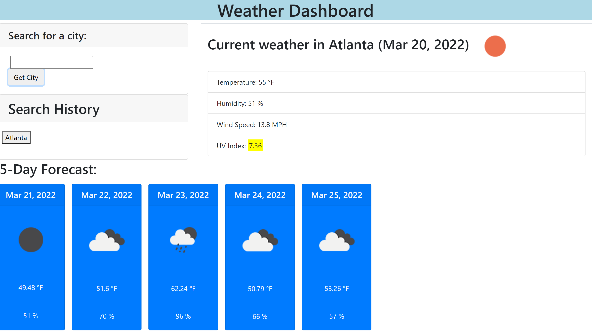

# Weather Dashboard

This application allows you to enter the name of a city and see the current weather forecast as well as the forecast over the next five days. 

## Using Weather Dashboard

When opening the application, you will be greeted with a search bar. Click inside of this search bar and type in the name of your current city, or any city you'd like to review the weather for. Click the "Get City" button. Once clicked, the current conditions for that city will appear on that page. Below the current conditions, you will be able to see the predicted conditions over the next five days.

## Links and Image

The live app can be found [here.](https://auscarter17.github.io/challenge-06-weather-dashboard/)

The GitHub repository can be found [here.](https://github.com/auscarter17/challenge-06-weather-dashboard)

